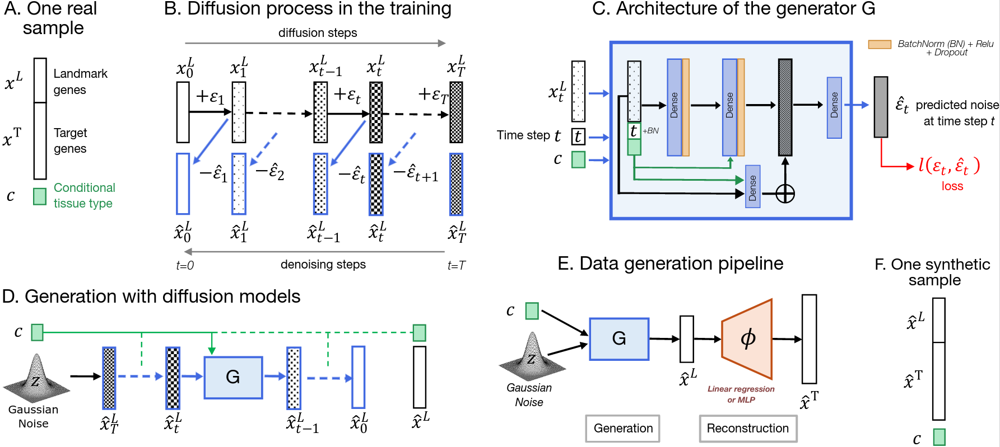
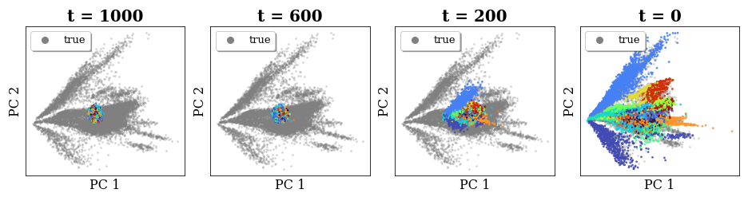
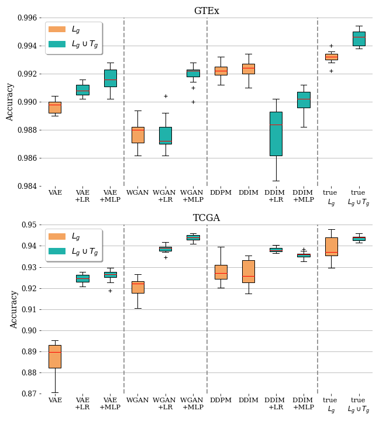

# Gene Expression Generation with Diffusion Models

(Repo under construction...)

  

**Pipeline overview for generating the L1000 landmark genes and reconstructing the full transcriptome.**

______________________________________________________________________________________________________________________

  

**PCA visualization of the generation process by our diffusion model on GTEx data (colors highlight the different tissue types).**

## Requirements

Install the required python librairies:

`pip install -r requirements.txt`

## RNA-seq datasets

The first dataset is the Genotype-Tissue Expression project (GTEx Analysis V8 release): 
- [About GTEx](https://gtexportal.org/home/)
- [GTEx_Analysis_2017-06-05_v8_RNASeQCv1.1.9_gene_tpm.gct.gz](https://gtexportal.org/home/downloads/adult-gtex/bulk_tissue_expression) to retrieve data

The second dataset is the Cancer Genome Atlas (TCGA): 
- [About TCGA](https://www.cancer.gov/about-nci/organization/ccg/research/structural-genomics/tcga)
- [R package](https://bioconductor.org/packages/release/bioc/html/RTCGA.html) to retrieve data

Preprocessing of the data in the `data` folder.

## Deep generative models
TODO

The baseline generative models are the following:
- Variational Autoencoder (VAE) [(Welling, M. and Kingma, D. P., 2014)](https://arxiv.org/abs/1312.6114)
- Wasserstein Gan with Gradient Penalty (WGAN-GP) [(Arjovsky et al., 2017)](https://proceedings.mlr.press/v70/arjovsky17a.html)

The diffusion models investigated are the following:
- Denoising Diffusion Probabilistic Model (DDPM) [(Ho et al., 2020)](https://proceedings.neurips.cc/paper/2020/file/4c5bcfec8584af0d967f1ab10179ca4b-Paper.pdf)
- Denoising Diffusion Implicit Model (DDIM) [(Song et al., 2021)](https://arxiv.org/abs/2010.02502)

Scripts of the different models can be found at the folder `./src/generation`.

## Metrics
To assess our generated expression data quality, we evaluated the data in a supervised and unsupervised manner.
Scripts of these metrics can be found in the `metrics` folder.

### Supervised performance indicators
- Reverse validation: the performance (accuracy) of a classifier trained only on generated data

### Unsupervised performance indicators
- Correlation score [(Vinas et al., 2022)](https://academic.oup.com/bioinformatics/article/38/3/730/6104825)
- Precision and Recall [(Kynkäänniemi et al., 2019)](https://arxiv.org/pdf/1904.06991.pdf)
- Frechet Distance (FD) [(Heusel et al., 2018)](https://arxiv.org/pdf/1706.08500.pdf)
- Adversarial accuracy (AA) [(Yale et al., 2020)](https://www.sciencedirect.com/science/article/abs/pii/S0925231220305117)

## Results

  

**Test classification accuracy using only landmark genes (orange) or the full transcriptome (blue). The baseline accuracy obtained with true data is displayed on the rightmost panel.**