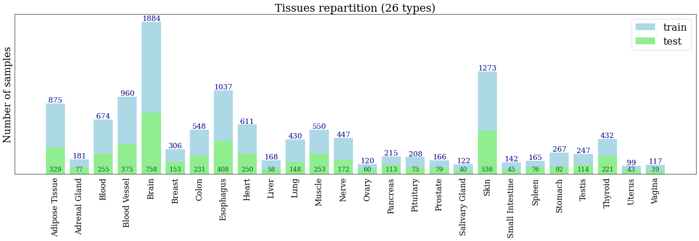
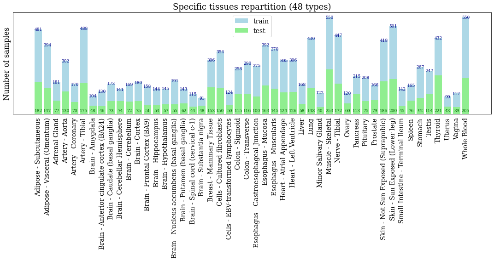

# GTEx data

  

  

Link to GTEx portal for Bulk RNA-Seq data (v8): https://gtexportal.org/home/downloads/adult-gtex/bulk_tissue_expression
1. Download the **RNA-Seq** zip file: GTEx_Analysis_2017-06-05_v8_RNASeQCv1.1.9_gene_tpm.gct.gz
2. Download the **clinical data** file:  GTEx_Analysis_v8_Annotations_SubjectPhenotypesDS.txt
3. Download the **tissue types** data file:  GTEx_Analysis_v8_Annotations_SampleAttributesDS.txt
4. Process and build the train/test GTEx datasets for all genes, all coding genes or both coding and landmark genes.

Arguments:
- PATH_GTEX: 'path_to_gtex_dataset.csv'
- PATH_TISSUES: 'path_to_tissues_dataset.csv'
- PATH_CLINICAL: 'path_to_clinical_dataset.csv'
- CODING: 'y' for coding genes only, otherwise 'n'
- LANDMARK: 'y' for landmark genes only, otherwise 'n'

> `python script_process_gtex.csv -path_gtex <PATH_GTEX> -path_tissues <PATH_TISSUES> -path_clinical <PATH_CLINICAL> -coding_genes <CODING> -only_landmark <LANDMARK>`

# TCGA data

The gene expression data and clinical data is retrieved from the Cancer Genome Analysis dataset, using the `RTCGA` package.
To retrieve the raw data (release data of 2015-11-01), run the following script: 

>`rtcga_rnaseq.R`

All cohort files should be contained in the "tcga_files" folder. 

## Preprocessing
To preprocess the data and generate the full csv file, run the following only once (in Python):

> `Processor = RNADataProcessor(_type_='data', cancer_type='all', dataset='tcga')`
> `Processor.preprocessing()`

This should be ran only once to generate the full expression dataset and the separate clinical data files.
Then, to build and load the full dataset with both gene expression and clinical data, run the following:

> `df = Loader.build_full_dataframe('/tcga_files')`

> `df.to_csv('/tcga_files/TCGA_rnaseq_RSEM_full_dataset.csv', index=False)`

Finally, to build and load the final preprocessed dataset with only the conditionning clinical variables of interest, run the following:
> `df_final = Loader.process_all_covariates('/tcga_files/TCGA_rnaseq_RSEM_full_dataset.csv')`

## Train-test split
To split (80%-20%) the full preprocessed TCGA dataset (including both gene expression and clinical data), run the following:

> `from utils_preprocessing import train_test_split`

> `df_train, df_test = train_test_split(df_final, split_ratios=[0.8, 0.2], shuffle=True)`

> `df_train.to_csv('/tcga_files/train_df_covariates.csv', index=False)`

> `df_test.to_csv('/tcga_files/test_df_covariates.csv', index=False)`

## Clinical data 
Different functions can be used to explore the data.
For instance: to take a look at the clinical data used in the conditionning of GANs, run the following:
> `df = Loader.fetch_covariates(cohort='BRCA')`

This will return a pandas dataframe with all the covariate variables: age, gender, cancer labels, tissue types, cancer types.
If `cohort='all'`, then the clinical variables for all cohorts will be returned in the dataframe.

Here are all the different cancer cohorts:

"ACC", "BLCA", "BRCA","CESC", "CHOL",
"COAD", "DLBC", "ESCA", "GBM", "HNSC",
"KICH", "KIRC", "KIRP", "LAML", "LGG",
"LIHC", "LUAD", "LUSC", "MESO", "OV",
"PAAD", "PCPG", "PRAD", "READ", "SARC",
"SKCM", "STAD", "STES", "TGCT", "THCA",
"THYM", "UCEC", "UCS", "UVM"

Here are all the cancer types:

'adrenocortical carcinoma', 
'bladder urothelial carcinoma',
'breast invasive carcinoma', 
'cervical squamous cell carcinoma endocervical adenocarcinoma', 
'cholangiocarcinoma', 
'colon adenocarcinoma', 
'lymphoid neoplasm diffuse large b-cell lymphoma', 
'esophageal carcinoma', 
'glioblastoma multiforme', 
'head neck squamous cell carcinoma',
'kidney chromophobe', 
'kidney renal clear cell carcinoma', 
'kidney renal papillary cell carcinoma', 
'acute myeloid leukemia', 
'brain lower grade glioma', 
'liver hepatocellular carcinoma', 
'lung adenocarcinoma', 
'lung squamous cell carcinoma',
'mesothelioma', 
'ovarian serous cystadenocarcinoma', 
'pancreatic adenocarcinoma', 
'pheochromocytoma and paraganglioma', 
'prostate adenocarcinoma', 
'rectum adenocarcinoma', 
'sarcoma', 
'skin cutaneous melanoma', 
'stomach adenocarcinoma',
'stomach esophageal carcinoma', 
'testicular germ cell tumors', 
'thyroid carcinoma', 
'thymoma', 
'uterine corpus endometrial carcinoma',
'uterine carcinosarcoma', 
'uveal melanoma'

There are **93.122 % of cancer samples** and **6.878 % of non cancerous samples** in the full dataset.